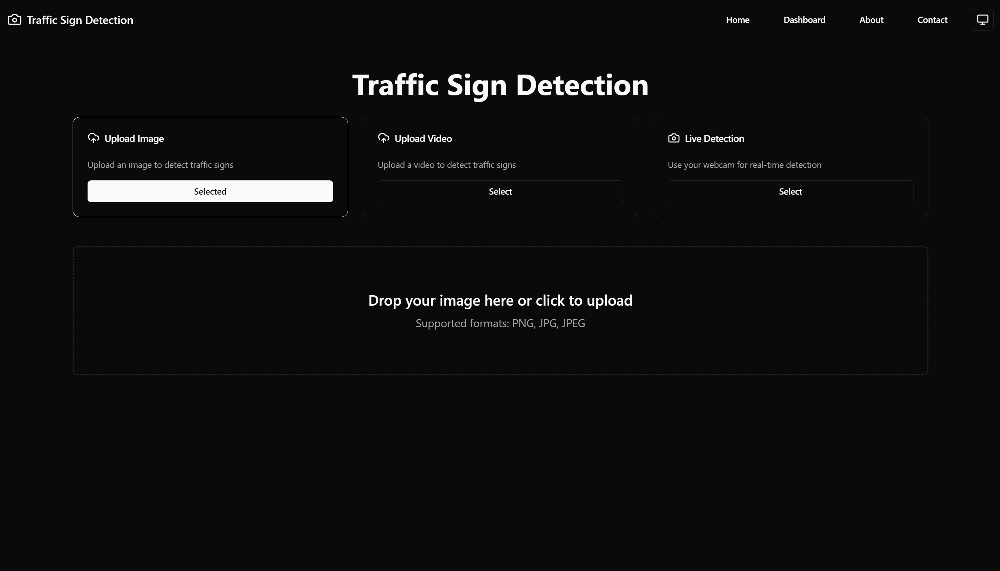
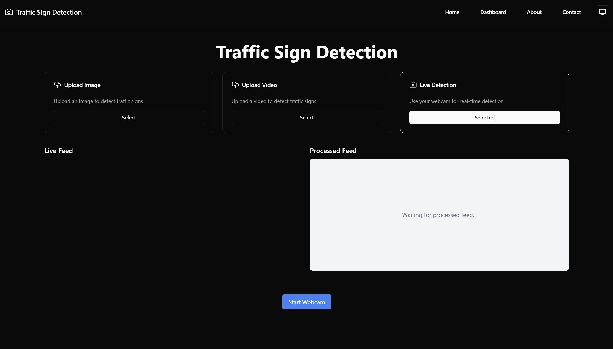
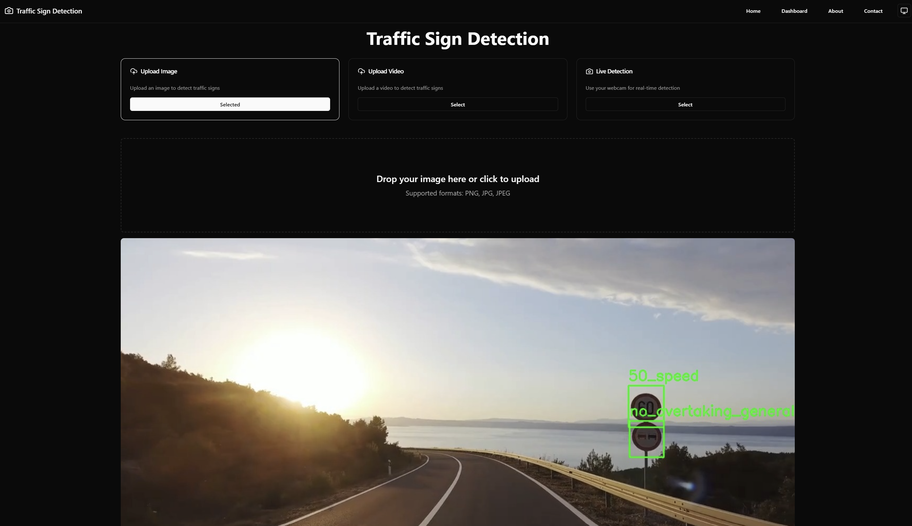
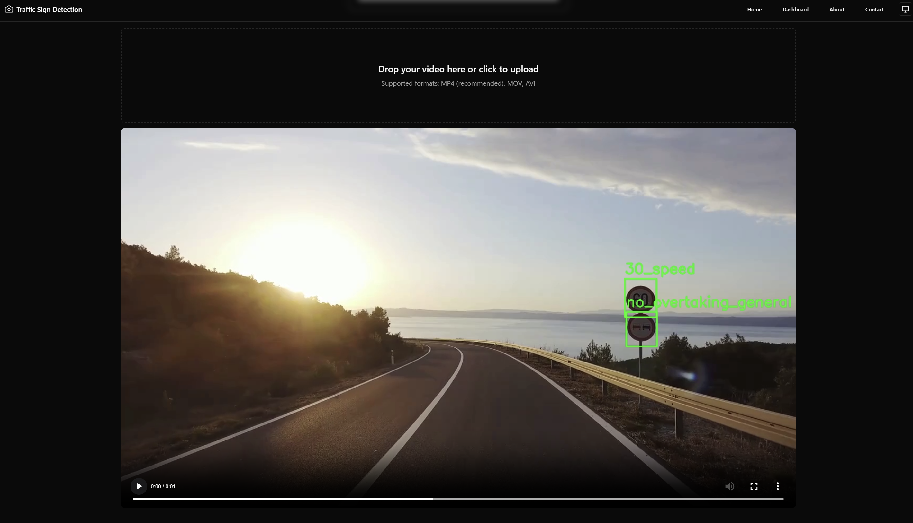

# Traffic Sign Recognition Web Application

A modern web application for real-time traffic sign detection and recognition using React, TypeScript, and WebSocket communication.

## Screenshots

| Mode | Screenshot |
|------|------------|
| Dashboard |  |
| Webcam Detection |  |
| Image Detection |  |
| Video Detection |  |

*Note: Add screenshots to the `docs/images` folder*

## Features

- 🚦 Real-time traffic sign detection using webcam feed
- 🖼️ Support for image file uploads
- 🎥 Support for video file analysis
- 🎯 Live detection visualization with bounding boxes
- 📊 Confidence scores for detections
- 💻 Modern, responsive UI using Tailwind CSS
- 🌓 Dark/Light mode support

## Tech Stack

- **Frontend Framework:** React + TypeScript
- **Styling:** Tailwind CSS + shadcn/ui
- **Build Tool:** Vite
- **Communication:** WebSocket for real-time data
- **State Management:** React Hooks

## Getting Started

### Prerequisites

- Node.js (v16 or higher)
- npm or yarn
- Backend server running (see backend repository)

### Installation

1. Clone the repository:
```bash
git clone https://github.com/yourusername/tsr-frontend.git
cd tsr-frontend
```

2. Install dependencies:
```bash
npm install
# or
yarn install
```

3. Configure environment variables:
Create a `.env` file in the root directory:
```env
VITE_API_URL=http://localhost:8000
VITE_WS_URL=ws://localhost:8000
```

4. Start the development server:
```bash
npm run dev
# or
yarn dev
```

The application will be available at `http://localhost:5173`

## Usage

### Image Detection
1. Select "Image" mode
2. Upload an image containing traffic signs
3. View detection results with bounding boxes and confidence scores

### Video Detection
1. Select "Video" mode
2. Upload a video file
3. Play the video to see real-time detections

### Live Webcam Detection
1. Select "Webcam" mode
2. Click "Start Webcam"
3. Allow camera access when prompted
4. View real-time detections on the processed feed

## Project Structure

```
src/
├── components/        # Reusable UI components
├── hooks/            # Custom React hooks
├── lib/              # Utility functions and API clients
├── pages/            # Page components
└── types/            # TypeScript type definitions
```

## Key Components

- `DetectionDisplay`: Handles rendering of detections on images/videos
- `WebSocketClient`: Manages real-time communication with backend
- `Dashboard`: Main interface for user interaction
- `UploadCard`: Component for file upload and mode selection

## Environment Variables

| Variable | Description | Default |
|----------|-------------|---------|
| VITE_API_URL | Backend API URL | http://localhost:8000 |
| VITE_WS_URL | WebSocket Server URL | ws://localhost:8000 |

## Contributing

1. Fork the repository
2. Create your feature branch (`git checkout -b feature/AmazingFeature`)
3. Commit your changes (`git commit -m 'Add some AmazingFeature'`)
4. Push to the branch (`git push origin feature/AmazingFeature`)
5. Open a Pull Request

## License

This project is licensed under the MIT License - see the [LICENSE](LICENSE) file for details.

## Acknowledgments

- Built using [React](https://reactjs.org/)
- UI components from [shadcn/ui](https://ui.shadcn.com/)
- Styling with [Tailwind CSS](https://tailwindcss.com/)